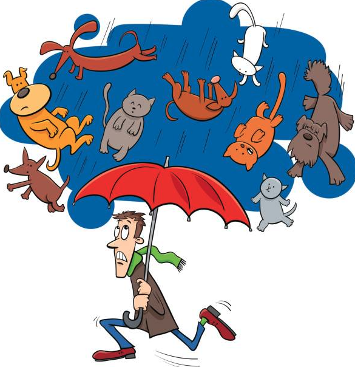
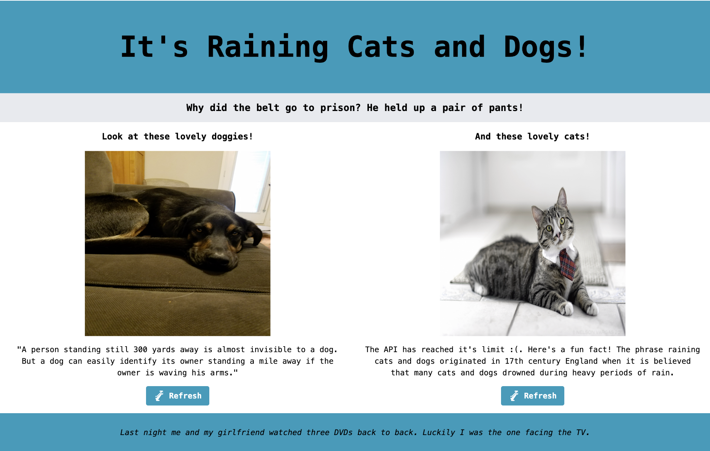

  

<h3 style="text-align: center;">Cats and Dogs API Fact and Image Generator</h3>

  

    A fun and silly single page webpage that utilises five different APIs to generate jokes, dog and cat images and facts.
     
    <a href="https://github.com/nonebula/cats-and-dogs"><strong>Explore the docs »</strong></a>
     
     
  

  
Table of Contents

  <ol>
    <li>
      <a href="#about-the-project">About The Project</a>
      <ul>
        <li><a href="#built-with">Built With</a></li>
      </ul>
    </li>
    <li>
      <a href="#getting-started">Getting Started</a>
      <ul>
        <li><a href="#prerequisites">Prerequisites</a></li>
        <li><a href="#installation">Installation</a></li>
      </ul>
    </li>
    <li><a href="#usage">Usage</a></li>
    <li><a href="#license">License</a></li>
    <li><a href="#contact">Contact</a></li>
    <li><a href="#acknowledgments">Acknowledgments</a></li>
  </ol>

## About The Project

This project was built to hone my skills and continue my learning around APIs and TypeScript. It was also my first experience implementing Tailwind CSS. The project is a simple single page webpage that implements five APIs to generate jokes, cat and dog images, and facts.

A screenshot of the page.

### Built With

- 
- 
- 
- 

## Getting Started

Given this is a simple project, all you need to do to get started is to visit the GitHub pages site at: https://nonebula.github.io/cats-and-dogs/. Use the refresh buttons to regenerate the facts and images, refresh the page to see more jokes.

I hope you enjoy the page and learn something new!

### Prerequisites

There are no prerequsites to interact with the page, but if you're downloading the repository to build on it, you're going to need to install the relevant dependencies using 'npm i' in the terminal.

### Installation

There are no installation instructions other than the relevant dependencies should you be downloading this to build on it.

## Usage

The usage of the site is very simple, simply click the refresh buttons to regenerate the facts and images, or refresh the page to see new jokes.

## License

Distributed under the MIT License. See the license for more information.

## Contact

Joe Higgs - [@no_nebula_8421](https://twitter.com/no_nebula_8421) - joe.higgs@live.com

Project Link: [https://github.com/nonebula/cats-and-dogs](https://nonebula.github.io/cats-and-dogs/)

## Acknowledgments

- <a href="https://icanhazdadjoke.com/#google_vignette">icanhazdadjoke.com:</a> Joke Generation API.
- <a href="https://github.com/AdenFlorian/random.dog">random.dog:</a> Dog image generation API.
- <a href="https://dogapi.dog/">dogapi.dog:</a> Dog Fact API.
